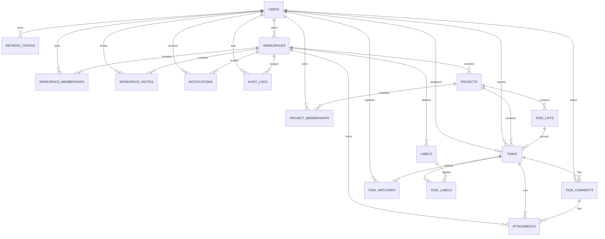

# Database Design

This document defines the production database design for TaskFlow. It is a design artifact only: no SQLAlchemy models, Alembic migrations, seed data, API handlers, or business logic are implemented in this milestone.

## Goals

- Model multi-tenant collaboration around workspaces, projects, task lists, tasks, comments, labels, notifications, and audit logs.
- Keep authorization boundaries explicit through workspace and project memberships.
- Support JWT authentication with secure refresh-token rotation.
- Preserve auditability for sensitive and collaborative actions.
- Keep the schema normalized enough to avoid inconsistent state while allowing targeted denormalization for performance later.
- Use PostgreSQL constraints and indexes to protect data integrity, not only application code.

## ER Diagram



## Entity Relationships

### Identity and Sessions

- `users` is the root identity table.
- `refresh_tokens` belongs to `users` and stores only hashed opaque refresh tokens.
- Refresh tokens are grouped by `family_id` so token reuse can revoke an entire session lineage.

### Workspace Boundary

- `workspaces` is the top-level tenant and authorization boundary.
- `workspace_memberships` is the many-to-many join between users and workspaces.
- `workspace_invites` stores pending, accepted, revoked, and expired invitation state.
- Workspace-owned entities include projects, labels, notifications, attachments, and audit logs.

### Project and Task Collaboration

- `projects` belongs to exactly one workspace.
- `project_memberships` optionally restricts private project access beyond workspace membership.
- `task_lists` belongs to a project and orders tasks into sections or board columns.
- `tasks` belongs to a project and optionally belongs to a task list.
- `task_comments`, `task_watchers`, `task_labels`, and task attachments hang off tasks.

### Notifications and Audit

- `notifications` belongs to the recipient user and may be scoped to a workspace.
- `audit_logs` is workspace-scoped and references actors and changed entities by type/id for flexible audit coverage.

## Tables

### `users`

Purpose: stores account identity.

Columns:

- `id uuid primary key`
- `email citext not null`
- `password_hash text not null`
- `display_name text not null`
- `avatar_url text null`
- `status text not null`
- `email_verified_at timestamptz null`
- `last_login_at timestamptz null`
- `created_at timestamptz not null`
- `updated_at timestamptz not null`
- `deleted_at timestamptz null`

Constraints:

- `unique(email)` for active account identity.
- `status in ('active', 'disabled', 'pending_verification')`.
- `char_length(display_name) between 1 and 120`.

Indexes:

- Unique btree on `email`.
- Btree on `status`.
- Partial btree on `deleted_at where deleted_at is null` is unnecessary unless active-user scans become common.

### `refresh_tokens`

Purpose: supports secure refresh-token rotation and session revocation.

Columns:

- `id uuid primary key`
- `user_id uuid not null references users(id)`
- `token_hash text not null`
- `family_id uuid not null`
- `parent_token_id uuid null references refresh_tokens(id)`
- `replaced_by_token_id uuid null references refresh_tokens(id)`
- `revoked_at timestamptz null`
- `revocation_reason text null`
- `expires_at timestamptz not null`
- `last_used_at timestamptz null`
- `user_agent text null`
- `ip_address inet null`
- `created_at timestamptz not null`

Constraints:

- `unique(token_hash)`.
- `revocation_reason in ('logout', 'rotation_reuse', 'admin_revoked', 'expired', 'password_changed')` when not null.
- `parent_token_id <> id`.
- `replaced_by_token_id <> id`.

Indexes:

- Btree on `user_id`.
- Btree on `family_id`.
- Btree on `expires_at`.
- Partial index on `(user_id, revoked_at) where revoked_at is null`.

### `workspaces`

Purpose: top-level tenant container.

Columns:

- `id uuid primary key`
- `owner_id uuid not null references users(id)`
- `name text not null`
- `slug text not null`
- `status text not null`
- `created_at timestamptz not null`
- `updated_at timestamptz not null`
- `archived_at timestamptz null`
- `deleted_at timestamptz null`

Constraints:

- `unique(slug)`.
- `status in ('active', 'archived', 'deleted')`.
- `char_length(name) between 1 and 160`.
- `slug` must be lowercase URL-safe text.

Indexes:

- Btree on `owner_id`.
- Btree on `slug`.
- Partial index on `status where deleted_at is null`.

### `workspace_memberships`

Purpose: user membership and workspace RBAC.

Columns:

- `id uuid primary key`
- `workspace_id uuid not null references workspaces(id)`
- `user_id uuid not null references users(id)`
- `role text not null`
- `status text not null`
- `invited_by_id uuid null references users(id)`
- `joined_at timestamptz null`
- `created_at timestamptz not null`
- `updated_at timestamptz not null`
- `removed_at timestamptz null`

Constraints:

- `unique(workspace_id, user_id)` for current design.
- `role in ('owner', 'admin', 'member', 'viewer')`.
- `status in ('active', 'invited', 'suspended', 'removed')`.
- At least one owner must be enforced by application transaction and optionally by deferred trigger in a later hardening milestone.

Indexes:

- Btree on `user_id`.
- Btree on `(workspace_id, role)`.
- Partial index on `(workspace_id, user_id) where status = 'active'`.

### `workspace_invites`

Purpose: tracks workspace invitations.

Columns:

- `id uuid primary key`
- `workspace_id uuid not null references workspaces(id)`
- `email citext not null`
- `role text not null`
- `token_hash text not null`
- `invited_by_id uuid not null references users(id)`
- `accepted_by_id uuid null references users(id)`
- `expires_at timestamptz not null`
- `accepted_at timestamptz null`
- `revoked_at timestamptz null`
- `created_at timestamptz not null`

Constraints:

- `unique(token_hash)`.
- `role in ('admin', 'member', 'viewer')`; owner invites are not allowed.
- Only one active invite per `(workspace_id, email)` through a partial unique index.

Indexes:

- Partial unique index on `(workspace_id, email) where accepted_at is null and revoked_at is null`.
- Btree on `expires_at`.
- Btree on `invited_by_id`.

### `projects`

Purpose: groups tasks within a workspace.

Columns:

- `id uuid primary key`
- `workspace_id uuid not null references workspaces(id)`
- `created_by_id uuid not null references users(id)`
- `name text not null`
- `slug text not null`
- `description text null`
- `visibility text not null`
- `status text not null`
- `created_at timestamptz not null`
- `updated_at timestamptz not null`
- `archived_at timestamptz null`
- `deleted_at timestamptz null`

Constraints:

- `unique(workspace_id, slug)`.
- `visibility in ('workspace', 'private')`.
- `status in ('active', 'archived', 'deleted')`.
- `char_length(name) between 1 and 160`.

Indexes:

- Btree on `workspace_id`.
- Btree on `(workspace_id, status)`.
- Partial index on `(workspace_id, slug) where deleted_at is null`.

### `project_memberships`

Purpose: project-specific RBAC for private projects and elevated project roles.

Columns:

- `id uuid primary key`
- `project_id uuid not null references projects(id)`
- `user_id uuid not null references users(id)`
- `role text not null`
- `created_at timestamptz not null`
- `updated_at timestamptz not null`
- `removed_at timestamptz null`

Constraints:

- `unique(project_id, user_id)`.
- `role in ('project_admin', 'editor', 'commenter', 'viewer')`.

Indexes:

- Btree on `user_id`.
- Btree on `(project_id, role)`.
- Partial index on `(project_id, user_id) where removed_at is null`.

### `task_lists`

Purpose: ordered sections or board columns within projects.

Columns:

- `id uuid primary key`
- `project_id uuid not null references projects(id)`
- `name text not null`
- `position integer not null`
- `created_at timestamptz not null`
- `updated_at timestamptz not null`
- `archived_at timestamptz null`
- `deleted_at timestamptz null`

Constraints:

- `unique(project_id, position)`.
- `char_length(name) between 1 and 120`.
- `position >= 0`.

Indexes:

- Btree on `project_id`.
- Btree on `(project_id, position)`.
- Partial index on `project_id where deleted_at is null`.

### `tasks`

Purpose: primary work item.

Columns:

- `id uuid primary key`
- `project_id uuid not null references projects(id)`
- `task_list_id uuid null references task_lists(id)`
- `assignee_id uuid null references users(id)`
- `reporter_id uuid not null references users(id)`
- `title text not null`
- `description text null`
- `status text not null`
- `priority text not null`
- `position integer not null`
- `due_at timestamptz null`
- `started_at timestamptz null`
- `completed_at timestamptz null`
- `created_at timestamptz not null`
- `updated_at timestamptz not null`
- `archived_at timestamptz null`
- `deleted_at timestamptz null`

Constraints:

- `status in ('todo', 'in_progress', 'blocked', 'done', 'canceled')`.
- `priority in ('low', 'medium', 'high', 'urgent')`.
- `char_length(title) between 1 and 240`.
- `position >= 0`.
- If `status = 'done'`, `completed_at` should be set by service logic; a database check can be added later if state transitions are stable.
- `task_list_id` must belong to the same project as `project_id`; enforce with a composite foreign key by adding `unique(id, project_id)` on `task_lists`.

Indexes:

- Btree on `project_id`.
- Btree on `task_list_id`.
- Btree on `assignee_id`.
- Btree on `(project_id, status)`.
- Btree on `(project_id, position)`.
- Btree on `due_at where due_at is not null and deleted_at is null`.
- Partial index on `(project_id, updated_at desc) where deleted_at is null`.

### `task_comments`

Purpose: stores discussion on tasks.

Columns:

- `id uuid primary key`
- `task_id uuid not null references tasks(id)`
- `author_id uuid not null references users(id)`
- `body text not null`
- `created_at timestamptz not null`
- `updated_at timestamptz not null`
- `edited_at timestamptz null`
- `deleted_at timestamptz null`

Constraints:

- `char_length(body) between 1 and 10000`.

Indexes:

- Btree on `task_id`.
- Btree on `author_id`.
- Btree on `(task_id, created_at) where deleted_at is null`.

### `labels`

Purpose: workspace-scoped labels.

Columns:

- `id uuid primary key`
- `workspace_id uuid not null references workspaces(id)`
- `name text not null`
- `color text not null`
- `created_at timestamptz not null`
- `updated_at timestamptz not null`
- `deleted_at timestamptz null`

Constraints:

- `unique(workspace_id, name)`.
- `char_length(name) between 1 and 80`.
- `color` should match a hex color pattern.

Indexes:

- Btree on `workspace_id`.
- Partial unique index on `(workspace_id, lower(name)) where deleted_at is null`.

### `task_labels`

Purpose: many-to-many join between tasks and labels.

Columns:

- `task_id uuid not null references tasks(id)`
- `label_id uuid not null references labels(id)`
- `created_at timestamptz not null`

Constraints:

- Primary key on `(task_id, label_id)`.
- Label must belong to the same workspace as the task's project; enforce in service logic initially, with optional database trigger later if needed.

Indexes:

- Btree on `label_id`.

### `task_watchers`

Purpose: users subscribed to task updates.

Columns:

- `task_id uuid not null references tasks(id)`
- `user_id uuid not null references users(id)`
- `created_at timestamptz not null`

Constraints:

- Primary key on `(task_id, user_id)`.

Indexes:

- Btree on `user_id`.

### `attachments`

Purpose: stores metadata for uploaded files attached to tasks or comments. File bytes live in object storage.

Columns:

- `id uuid primary key`
- `workspace_id uuid not null references workspaces(id)`
- `task_id uuid null references tasks(id)`
- `comment_id uuid null references task_comments(id)`
- `uploaded_by_id uuid not null references users(id)`
- `storage_key text not null`
- `filename text not null`
- `content_type text not null`
- `size_bytes bigint not null`
- `checksum text null`
- `created_at timestamptz not null`
- `deleted_at timestamptz null`

Constraints:

- Exactly one of `task_id` or `comment_id` must be non-null.
- `unique(storage_key)`.
- `size_bytes > 0`.
- `char_length(filename) between 1 and 255`.

Indexes:

- Btree on `workspace_id`.
- Btree on `task_id`.
- Btree on `comment_id`.
- Btree on `uploaded_by_id`.
- Partial index on `workspace_id where deleted_at is null`.

### `notifications`

Purpose: durable notification inbox.

Columns:

- `id uuid primary key`
- `user_id uuid not null references users(id)`
- `workspace_id uuid null references workspaces(id)`
- `actor_id uuid null references users(id)`
- `type text not null`
- `title text not null`
- `body text null`
- `payload_json jsonb not null`
- `read_at timestamptz null`
- `created_at timestamptz not null`
- `deleted_at timestamptz null`

Constraints:

- `char_length(title) between 1 and 240`.
- `type` should use a controlled set maintained in application constants and migrations when stabilized.

Indexes:

- Btree on `(user_id, created_at desc)`.
- Partial index on `(user_id, created_at desc) where read_at is null and deleted_at is null`.
- GIN index on `payload_json` only if querying inside payload becomes required.

### `audit_logs`

Purpose: immutable audit trail for security and collaborative changes.

Columns:

- `id uuid primary key`
- `workspace_id uuid null references workspaces(id)`
- `actor_id uuid null references users(id)`
- `entity_type text not null`
- `entity_id uuid not null`
- `action text not null`
- `before_json jsonb null`
- `after_json jsonb null`
- `metadata_json jsonb not null`
- `created_at timestamptz not null`

Constraints:

- No `updated_at` or `deleted_at`; audit rows are append-only.
- `char_length(entity_type) between 1 and 80`.
- `char_length(action) between 1 and 120`.

Indexes:

- Btree on `(workspace_id, created_at desc)`.
- Btree on `(entity_type, entity_id, created_at desc)`.
- Btree on `actor_id`.
- GIN indexes on JSON fields only if audit search requires them.

## Normalization Decisions

- Use normalized join tables for many-to-many relationships: `workspace_memberships`, `project_memberships`, `task_labels`, and `task_watchers`.
- Keep labels workspace-scoped instead of project-scoped so tasks across projects can use common taxonomy.
- Keep notifications as durable rows instead of ephemeral WebSocket-only events so clients can recover missed events.
- Store attachment metadata in PostgreSQL but binary files in object storage to keep database backups and queries manageable.
- Store audit data in append-only `audit_logs` with JSON snapshots because audited entity shapes vary.
- Keep task status and priority as constrained text initially. PostgreSQL enums can be considered later, but text checks make early iteration and migrations less rigid.
- Avoid duplicating `workspace_id` onto `tasks` at first because it is derivable through `projects`. If query volume needs it, add denormalized `workspace_id` with strict composite foreign keys in a later performance migration.
- Avoid storing unread notification counts on users initially; compute from indexed notifications or maintain a derived counter later if needed.

## Foreign Key Strategy

- Use UUID primary keys on all durable entities.
- Use explicit foreign keys for all direct ownership relationships.
- Prefer `on delete restrict` for collaborative core records so accidental parent deletion cannot cascade large user-visible data.
- Use soft deletes for workspaces, projects, task lists, tasks, comments, labels, attachments, and notifications.
- Use hard deletes only for ephemeral or security cleanup records after retention windows, such as expired refresh tokens and invites.
- Use composite foreign keys where needed to enforce same-parent relationships, starting with `tasks(task_list_id, project_id)` to ensure the list belongs to the task project.
- For actor references in audit logs, keep nullable foreign keys so historical audit records survive user deletion/anonymization.

## Constraint Strategy

- Add `not null` constraints on required fields.
- Add check constraints for status, role, priority, visibility, size, position, and basic text lengths.
- Use partial unique indexes for uniqueness among non-deleted or active records when soft delete is involved.
- Use database-level uniqueness for slugs, emails, active invites, and join tables.
- Use application-level transactional checks for cross-row invariants that are hard to express safely, such as ensuring each workspace always has at least one owner.
- Promote application-level invariants to deferred constraints or triggers only after behavior stabilizes.

## Index Strategy

Global principles:

- Index every foreign key used in joins.
- Index common list filters and sort keys together.
- Use partial indexes for active, unread, or non-deleted subsets.
- Avoid premature GIN indexes on JSONB until query patterns justify them.
- Keep write-heavy join tables lean.

Expected high-value indexes:

- `users(email unique)`
- `refresh_tokens(token_hash unique)`
- `refresh_tokens(user_id, revoked_at) where revoked_at is null`
- `workspace_memberships(user_id)`
- `workspace_memberships(workspace_id, user_id) where status = 'active'`
- `projects(workspace_id, status)`
- `task_lists(project_id, position)`
- `tasks(project_id, status)`
- `tasks(project_id, position)`
- `tasks(assignee_id)`
- `tasks(due_at) where due_at is not null and deleted_at is null`
- `task_comments(task_id, created_at) where deleted_at is null`
- `notifications(user_id, created_at desc)`
- `notifications(user_id, created_at desc) where read_at is null and deleted_at is null`
- `audit_logs(workspace_id, created_at desc)`
- `audit_logs(entity_type, entity_id, created_at desc)`

## Soft Delete Strategy

Soft-deleted tables:

- `users`
- `workspaces`
- `projects`
- `task_lists`
- `tasks`
- `task_comments`
- `labels`
- `attachments`
- `notifications`

Rules:

- Soft delete by setting `deleted_at`.
- Archive user-facing containers with `archived_at` when the record may become active again.
- Queries should default to `deleted_at is null`.
- Destructive deletes of workspaces or projects should be asynchronous and retention-based if ever needed.
- Comments should retain row identity after deletion but hide or redact body according to product policy.
- Audit logs are never soft deleted through normal app flows.
- Membership removal uses `removed_at` and status updates rather than deleting rows.

## Audit Tables

Primary table: `audit_logs`.

Audited actions:

- Authentication security events: password changed, sessions revoked, refresh reuse detected.
- Workspace events: created, updated, archived, deleted, ownership transferred.
- Membership events: invited, accepted, role changed, suspended, removed.
- Project events: created, updated, archived, restored, deleted.
- Task events: created, updated, moved, assigned, completed, deleted.
- Comment events: created, edited, deleted.
- Label events: created, updated, deleted.
- Attachment events: attached, detached, deleted.

Audit design:

- Store `before_json` and `after_json` snapshots for meaningful changes.
- Store request metadata in `metadata_json`, including request ID, IP metadata if allowed, user agent, and correlation IDs.
- Keep audit writes inside the same transaction as the mutation where possible.
- For asynchronous events, include job ID and originating request ID.
- Make audit records append-only at the application layer; database permissions should prevent normal application users from updating or deleting audit rows.

## SQLAlchemy Model Plan

Base conventions:

- Use SQLAlchemy 2.x declarative mappings.
- Use UUID primary keys, generated in Python or PostgreSQL consistently.
- Use timezone-aware `DateTime(timezone=True)` for all timestamps.
- Use `server_default=func.now()` for `created_at` where appropriate and explicit updates for `updated_at`.
- Use mixins for repeated columns:
  - `UUIDPrimaryKeyMixin`
  - `TimestampMixin`
  - `SoftDeleteMixin`
  - `ArchiveMixin`
- Keep ORM relationships explicit with `back_populates`.
- Avoid eager loading by default; define query options in repository/query layer.
- Set `passive_deletes` intentionally and avoid accidental ORM cascades across collaborative data.

Model modules:

```text
backend/app/db/base.py
backend/app/db/types.py
backend/app/domains/users/models.py
backend/app/domains/auth/models.py
backend/app/domains/workspaces/models.py
backend/app/domains/projects/models.py
backend/app/domains/tasks/models.py
backend/app/domains/notifications/models.py
backend/app/domains/audit/models.py
```

Planned model classes:

- `User`
- `RefreshToken`
- `Workspace`
- `WorkspaceMembership`
- `WorkspaceInvite`
- `Project`
- `ProjectMembership`
- `TaskList`
- `Task`
- `TaskComment`
- `Label`
- `TaskLabel`
- `TaskWatcher`
- `Attachment`
- `Notification`
- `AuditLog`

SQLAlchemy constraints and indexes:

- Define foreign keys, check constraints, unique constraints, and indexes in models so Alembic autogenerate can detect most changes.
- Name constraints explicitly using a metadata naming convention.
- Use PostgreSQL-specific types for `CITEXT`, `INET`, and `JSONB` where required.
- Represent controlled text values with Python enums at the application boundary while storing as constrained text in the database.

## Alembic Migration Plan

Initial setup:

- Initialize Alembic during backend scaffold milestone.
- Configure SQLAlchemy metadata naming conventions before creating the first migration.
- Enable PostgreSQL extensions in the first migration:
  - `pgcrypto` if UUIDs are generated by PostgreSQL.
  - `citext` for case-insensitive emails.

Migration sequence:

1. `0001_extensions_and_users`
   - Enable extensions.
   - Create `users`.
   - Create baseline timestamp and status constraints.
2. `0002_auth_refresh_tokens`
   - Create `refresh_tokens`.
   - Add token-family indexes.
3. `0003_workspaces_memberships_invites`
   - Create `workspaces`, `workspace_memberships`, `workspace_invites`.
   - Add workspace role/status constraints and invite partial indexes.
4. `0004_projects`
   - Create `projects` and `project_memberships`.
5. `0005_tasks_core`
   - Create `task_lists`, `tasks`, `task_comments`.
   - Add ordering and task filter indexes.
6. `0006_labels_watchers_attachments`
   - Create `labels`, `task_labels`, `task_watchers`, `attachments`.
7. `0007_notifications_audit`
   - Create `notifications` and `audit_logs`.
8. `0008_cross_table_constraints`
   - Add composite constraints that require all dependent tables to exist.
   - Add any deferred constraints or triggers that have been validated by tests.

Migration rules:

- Every migration must have a downgrade path unless a documented forward-only production decision is made.
- Avoid combining unrelated schema changes once the project has shipped.
- For large future tables, use expand-and-contract migrations.
- Add indexes concurrently in production migrations when table size requires it.
- Never perform destructive data migrations without a backup and rollback plan.
- Include migration tests that apply all migrations from an empty database.

## Open Design Decisions

- Whether UUIDs are generated by Python or PostgreSQL. Recommendation: generate in Python for testability and portability, while still enabling `pgcrypto` if database-side generation is useful.
- Whether project-private access requires every member to have `project_memberships` rows. Recommendation: only private projects require explicit project membership; workspace-visible projects rely on workspace role.
- Whether to denormalize `workspace_id` onto high-volume tables such as `tasks`, `task_comments`, and `notifications`. Recommendation: defer until query plans show need.
- Whether audit immutability should be enforced by database trigger or database role permissions. Recommendation: start with database permissions and application policy, then add triggers if compliance requirements demand it.
